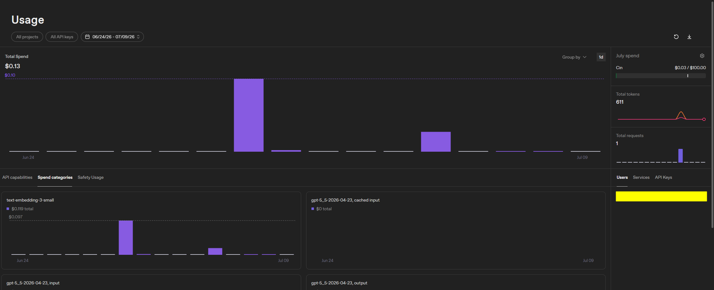
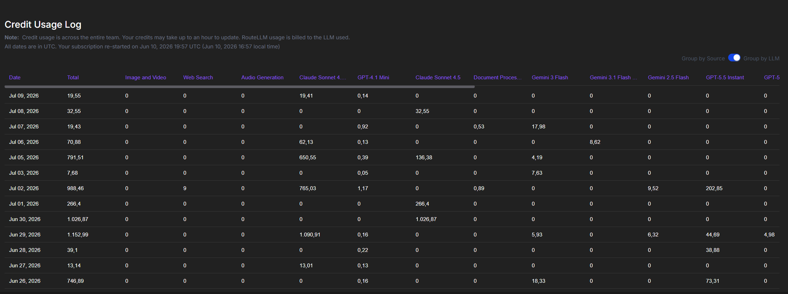
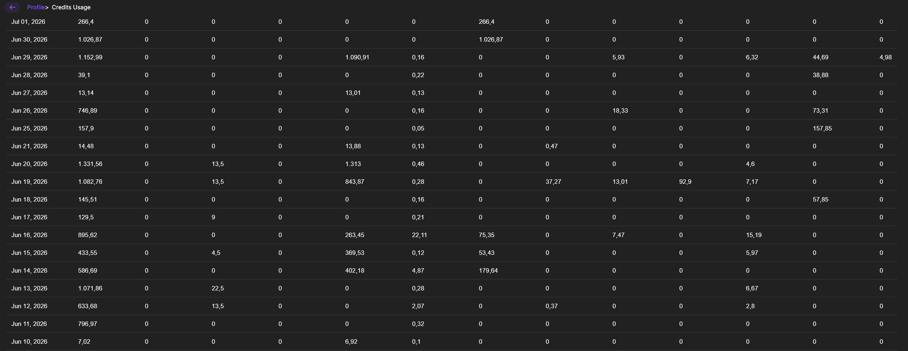
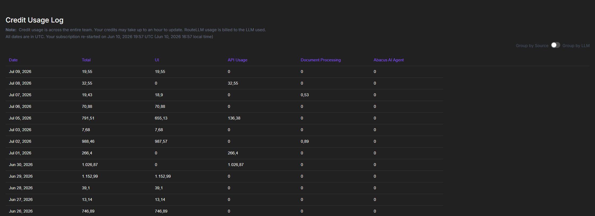
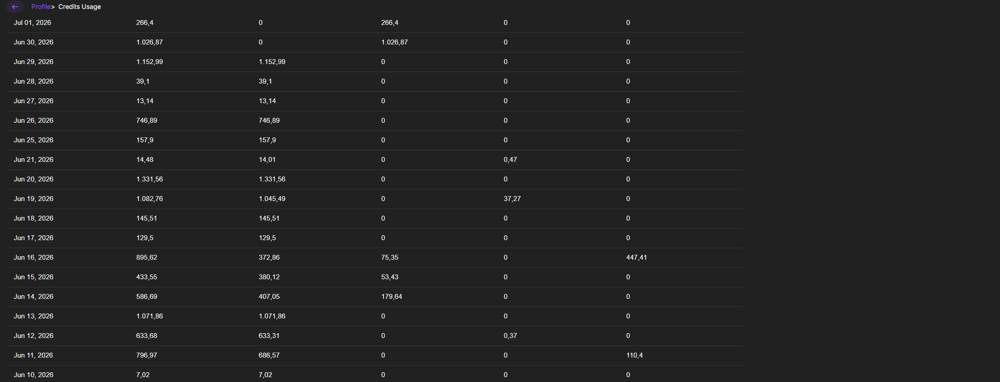

# AI-Assisted Development Workflow — the team / the system

## About this document

This document records how the team used AI tools and techniques throughout the development of **the system**. It is updated at each project phase and delivered together with the application at the final presentation.

Beyond the qualitative record of AI usage, this document captures **cost-efficiency** data: token consumption, real human effort, and a counterfactual estimate of the equivalent cost without AI assistance. The goal is to enable, at the end of the term, a comparative analysis between the real cost of AI-assisted development and the estimated cost of development carried out entirely by human professionals in the equivalent profiles.

---

## Tools used

| Tool                        | Category                  | When used                                                                                                          | Model/Version                                     | Real cost                                   | Rating     |
| --------------------------- | ------------------------- | ----------------------------------------------------------------------------------------------------------------- | ------------------------------------------------- | ------------------------------------------- | ---------- |
| Abacus AI (ChatLLM)         | LLM Platform / Assistant  | Architecture planning, domain analysis, design sessions, and test queries for the system                          | Claude Sonnet 4.5 / GPT-4.1 Mini / Gemini 3 Flash | ~12,443 credits Jun–Jul 2026 (~$12 est.)    | ⭐⭐⭐⭐⭐ |
| GitHub Copilot (Agent Mode) | Code generation / Agent   | Full implementation of the 8 specs (backend + frontend + tests), refactoring, spec reading, optimizations and UX improvements | Claude Sonnet 4.6 (not Opus 4 — flat subscription) | **$57 total / 3 months (Business, flat subscription)** | ⭐⭐⭐⭐⭐ |
| OpenAI API                  | Embeddings / Completions  | Repository indexing via `text-embedding-3-small`; GPT-5.5 completion tests during development                      | text-embedding-3-small + gpt-5_5-2026-04-23       | **$0.13 — confirmed (screenshot)**          | ⭐⭐⭐⭐   |

> **Cost note:** GitHub Copilot Business is billed as a flat subscription ($19/month, $57 total over the project) — it does NOT charge per token. This amount is included in the cost-efficiency calculations because it represents the real economic cost of AI-assisted development.

---

## Phase: Pre-proposal and Proposal v1 (Classes 8-13)

### Where AI helped

- **Comparative domain analysis:** We used ChatLLM (Claude) to analyze the 10 domains from the menu, classify them by difficulty, and generate a proposal_v1 for each. This significantly accelerated the team's decision — instead of researching each domain individually, we had a panoramic view in minutes.
- **Architecture structuring:** The AI generated the full project structure (folders, modules, dependencies), including reference code for the main components (feature extractor, smell detector, refactor agent). This served as a concrete starting point for technical discussion.
- **Related-work research:** The AI helped identify existing tools (Sourcegraph Cody, Swimm) and relevant papers, accelerating the state-of-the-art survey.
- **Proposal generation:** The PROPOSTA_v1.md template was filled out with AI assistance, which helped articulate the problem, the solution, and the success criteria in a structured way.
- **Technical feasibility analysis:** The AI detailed the full stack, cloud deployment options, and performed a risk analysis — information that would have required hours of individual research.

### Where AI did not help (or got in the way)

- **Domain decision:** The final choice (D8) was made by the team via voting — the AI recommended D4, D2 and D7 as more balanced, but the team preferred the challenge of D8. The AI cannot capture the team's personal preferences and motivations.
- **Course-specific context:** The AI initially generated content for D9 (Technical Debt) before the team defined D8. There was rework when switching domains.
- **Realistic time estimates:** The effort estimates generated by the AI tend to be optimistic — the team had to adjust them based on the members' real experience.

### Notable prompts of this phase

- Prompt for comparative analysis of the 10 domains with difficulty classification
- Prompt for generating the backend + AI project structure
- Prompt for filling out PROPOSTA_v1.md following the instructor's template

### Decisions made without AI

- **Choice of domain D8:** Team vote on WhatsApp
- **Team composition and role distribution:** Collective decision based on affinities and experience
- **Project name definition:** Decided collectively by the team
- **MVP prioritization:** Group discussion on what is feasible in 8 weeks

### Cost-efficiency record for this phase

#### Layer 1 — AI consumption

| Activity                                                     | Tool/Model          | Input tokens (est.) | Output tokens (est.) | Estimated cost (USD)              |
| ------------------------------------------------------------ | ------------------- | ------------------- | -------------------- | --------------------------------- |
| Analysis of the 10 domains + classification                  | Abacus AI (ChatLLM) | ~8,000              | ~6,000               | Included in the Abacus AI plan    |
| Project structure generation (backend + AI)                  | Abacus AI (ChatLLM) | ~5,000              | ~12,000              | Included in the Abacus AI plan    |
| Production-ready best-practices analysis                     | Abacus AI (ChatLLM) | ~4,000              | ~15,000              | Included in the Abacus AI plan    |
| Product vision (enterprise flow)                             | Abacus AI (ChatLLM) | ~3,000              | ~10,000              | Included in the Abacus AI plan    |
| Generation of PROPOSTA_v1.md                                 | Abacus AI (ChatLLM) | ~6,000              | ~8,000               | Included in the Abacus AI plan    |
| Generation of WORKFLOW_DOCUMENT.md                           | Abacus AI (ChatLLM) | ~4,000              | ~6,000               | Included in the Abacus AI plan    |
| GitHub Copilot Business — subscription (Apr 2026 prorated)   | GitHub Copilot      | —                   | —                    | **~$5.00**                        |
| **Phase total**                                              |                     | **~30,000 (est.)**  | **~57,000 (est.)**   | **~$6.00** (~R$34)                |

> **Note:** Abacus AI ChatLLM is billed by platform credits (not directly per token to the user). The credit log starts on Jun 10, 2026 (subscription restart), so usage in this phase is estimated based on the volume of conversations. GitHub Copilot Business: flat $19/month subscription — there is no per-token charge. This phase's cost is the prorated share of the subscription (~$5 of $57 total for the project).

#### Layer 2 — Real human effort (self-declared)

| Activity                          | Member (profile)      | Time with AI (h) | Review/adjust time (h)      | Notes                                              |
| --------------------------------- | --------------------- | ---------------- | --------------------------- | -------------------------------------------------- |
| Domain analysis and voting        | Member A (junior)     | 0.5h             | 0.5h (group discussion)     | AI generated the analysis, the team discussed and voted |
| Project structure                 | Member B (mid-level)  | 1.0h             | 0.5h (technical review)     | Reference code useful as a starting point          |
| Best-practices research           | Member C (junior)     | 0.5h             | 0.3h                        | Dense content, required careful reading            |
| Product vision                    | Member D (junior)     | 0.5h             | 0.2h                        | Helped think about the product beyond the MVP      |
| PROPOSTA_v1 writing               | Member E (mid-level)  | 1.0h             | 1.0h (collective review)    | Template filled by the AI, reviewed by everyone    |
| Workflow Doc writing              | Member A (junior)     | 0.5h             | 0.5h                        | Process record                                     |
| **Phase total**                   |                       | **4.0h**         | **3.0h**                    | **7.0h total human effort**                        |

> **Reference profiles:** Classification based on the members' experience with the technologies involved in this specific activity, not on their general profile.

#### Layer 3 — Counterfactual estimate

| Activity                                        | Equivalent profile | Estimated time without AI (h) | Avg. hourly wage (R$) | Estimated human cost (R$) |
| ----------------------------------------------- | ------------------ | ----------------------------- | --------------------- | ------------------------- |
| Comparative analysis of the 10 domains          | Mid-level          | 6.0h                          | R$38                  | R$228                     |
| Architecture definition + project structure     | Senior             | 8.0h                          | R$62                  | R$496                     |
| Best-practices research (production-ready)       | Senior             | 5.0h                          | R$62                  | R$310                     |
| Product and market-flow analysis                | Mid-level          | 4.0h                          | R$38                  | R$152                     |
| Full proposal writing                           | Mid-level          | 6.0h                          | R$38                  | R$228                     |
| Workflow documentation                          | Junior             | 2.0h                          | R$22                  | R$44                      |
| **Phase total**                                 |                    | **31.0h**                     |                       | **R$1,458**               |

> **Wage sources (corrected):** Regional labour market (IT, 2026) — Junior: R$22/h (~R$3,520/month), Mid-level: R$38/h (~R$6,080/month), Senior: R$62/h (~R$9,920/month). Basis: gross monthly salary ÷ 160 working hours. Higher-cost national hubs pay 40–60% more — the previous values (R$40/R$75/R$115) corresponded to those markets and were corrected to reflect the regional reality.
>
> **Methodology:** The estimated time without AI reflects how long a professional of the indicated profile would take to perform the same activity from scratch, without assistance from any generative-AI tool. It includes reasoning/planning (~25%), implementation/execution (~60%), and research/documentation (~15%).

### Partial cost-efficiency analysis (this phase)

- **AI tooling cost:** ~$6 USD — prorated Copilot Business (~$5) + estimated Abacus AI ChatLLM (~$1) = **~R$34** (exchange rate R$5.70/USD)
- **Human cost of the 7.0h (mid-level profile, R$38/h):** ~R$266 — ChatLLM replaced ~24h of individual research and ~7h of structured document writing
- **Total cost with AI:** **~R$300**
- **Counterfactual cost without AI:** **~R$1,458** — corrected with real regional labour-market rates 2026 (Senior R$62/h, Mid-level R$38/h, Junior R$22/h)
- **Cost-efficiency ratio:** **4.9x** (each R$1 spent with AI was equivalent to ~R$4.90 without AI)
- **Estimated saving:** ~R$1,158 (79.4%)

> **Limitations of this partial analysis:**
>
> 1. The counterfactual is a subjective estimate — team members are students, not professionals with the indicated profiles
> 2. The quality of the AI output may differ from what a professional would produce
> 3. The time spent learning the AI tools is not accounted for
> 4. The AI initially generated content for D9 before the team defined D8 — this rework is not reflected in the numbers

### Lessons learned

- The AI is excellent for generating structured "first drafts" — but human review is indispensable
- Defining the domain BEFORE asking the AI to elaborate avoids rework
- ChatLLM was more useful for structuring and research tasks than for decisions that depend on the team's personal context
- Keeping the cost-efficiency record from the start is laborious but valuable — doing it retroactively would be much harder

---

## Phase: P1 (problem framing) (Classes 14-20)

Full implementation of specifications SPEC-0001 through SPEC-0008 with AI assistance (GitHub Copilot / Claude Opus 4).

### Where AI helped

- **Full code generation:** The AI generated the complete implementation of the backend (FastAPI, services, controllers, adapters, tests) and frontend (React/TypeScript) for all 8 specifications.
- **Consistent hexagonal architecture:** It kept the ports/adapters pattern, dependency injection, and in-memory fallback across all modules without deviation.
- **Test generation:** It created complete unit, integration, and E2E test suites for each spec, covering positive and negative scenarios.
- **Spec reading and interpretation:** The AI read each spec's `design.md` and `tasks.md` files and translated them directly into functional code.
- **Incremental refactoring:** When adding new specs, the AI correctly updated `main.py`, `dependencies.py`, `models.py`, `App.tsx` and `http.ts` without breaking previous functionality.
- **Observability infrastructure:** It generated correlation ID middleware, structured logging, metrics collector and alert evaluation without the need for external libraries.

### Where AI did not help (or got in the way)

- **Dependency installation on Windows:** The `tokenizers` build failed due to the absence of the Rust toolchain — the AI could not resolve this local environment issue.
- **Long session context:** In very long conversations, it was necessary to compact the context — a risk of losing details of previous decisions.
- **UX decisions:** The generated layout is functional but lacks refined design — visual choices require human review.

### Notable prompts of this phase

- "Analise todo o projeto e tambem a parte de especificações veja se ta tudo ok da fase 1 e fase 2 e prossiga para a fase 3 e 4"
- "Agora verifique se ta tudo ok e faça as proximas fases até o fim ok?"
- "continue sem instalar nada" (to proceed without blocking on dependencies)

### Decisions made without AI

- **Implementation order definition:** SPECs were implemented in the numerical order defined by the team
- **Choice not to use external observability libraries:** Decision to keep everything in-house for simplicity
- **Decision to use in-memory fallback in all adapters:** Standard to work without PostgreSQL/ChromaDB in dev

### Cost-efficiency record for this phase

#### Layer 1 — AI consumption

| Activity                                                                          | Tool/Model                         | Input tokens (est.) | Output tokens (est.) | Estimated cost (USD)            |
| --------------------------------------------------------------------------------- | ---------------------------------- | ------------------- | -------------------- | ------------------------------- |
| SPEC-0001: Monolith Foundation (backend + Docker + frontend base)                 | GitHub Copilot / Claude Sonnet 4.6 | ~35,000             | ~45,000              | Included in the Copilot plan    |
| SPEC-0002: Repo Index & RAG (embedding, chunking, retrieval, chat)                | GitHub Copilot / Claude Sonnet 4.6 | ~30,000             | ~40,000              | Included in the Copilot plan    |
| SPEC-0003: Guided Tour (scoring, persistence, step viewer)                        | GitHub Copilot / Claude Sonnet 4.6 | ~25,000             | ~35,000              | Included in the Copilot plan    |
| SPEC-0004: Module Dependency Visualization (AST, graph, frontend)                 | GitHub Copilot / Claude Sonnet 4.6 | ~20,000             | ~30,000              | Included in the Copilot plan    |
| SPEC-0005: Commit History Decision Intelligence (ingest, classify, timeline, why) | GitHub Copilot / Claude Sonnet 4.6 | ~25,000             | ~35,000              | Included in the Copilot plan    |
| SPEC-0006: Onboarding Metrics & Evaluation (events, feedback, KPIs, dashboard)    | GitHub Copilot / Claude Sonnet 4.6 | ~18,000             | ~28,000              | Included in the Copilot plan    |
| SPEC-0007: Auth & Onboarding Sessions (auth, sessions, checkpoints, UI)           | GitHub Copilot / Claude Sonnet 4.6 | ~15,000             | ~25,000              | Included in the Copilot plan    |
| SPEC-0008: Observability & Operational Readiness (logging, metrics, ops, alerts)  | GitHub Copilot / Claude Sonnet 4.6 | ~18,000             | ~28,000              | Included in the Copilot plan    |
| GitHub Copilot Business — subscription (prorated May–Jun 2026, main phase)         | GitHub Copilot Business            | —                   | —                    | **~$15.00**                     |
| Abacus AI ChatLLM — spec planning (Jun 10–15)                                      | Abacus AI                          | —                   | —                    | ~$3.00                          |
| **Phase total**                                                                   |                                    | **~186,000 (est.)** | **~266,000 (est.)**  | **~$18.00** (~R$103)            |

> **Important note on model and cost:** GitHub Copilot Agent Mode uses **Claude Sonnet 4.6** (not Claude Opus 4 as indicated earlier). More importantly: Copilot Business is billed via a **flat $19/month subscription** — **there is no per-token charge to the user**. The per-SPEC individual costs estimated in the earlier document (~$22.74 total) were computed with Claude Opus 4 per-token prices ($15/M input + $75/M output) and are **incorrect**. The real cost of this phase is the prorated share of the subscription ($15) + Abacus AI usage from Jun 10 ($3).

#### Layer 2 — Real human effort (self-declared)

| Activity                                 | Member (profile)     | Time with AI (h) | Review/adjust time (h) | Notes                             |
| ---------------------------------------- | -------------------- | ---------------- | ---------------------- | --------------------------------- |
| SPEC-0001 + SPEC-0002 (foundation + RAG) | Team member (mid-level) | 2.0h          | 1.0h                   | Full initial project setup        |
| SPEC-0003 (guided tour)                  | Team member (mid-level) | 1.5h          | 0.5h                   | Scoring + persistence + UI        |
| SPEC-0004 (dependency graph)             | Team member (mid-level) | 1.0h          | 0.5h                   | AST parsing + graph frontend      |
| SPEC-0005 (commit history)               | Team member (mid-level) | 1.5h          | 0.5h                   | Classifier + timeline + why       |
| SPEC-0006 (metrics)                      | Team member (mid-level) | 1.0h          | 0.3h                   | KPIs + dashboard                  |
| SPEC-0007 (auth/sessions)                | Team member (mid-level) | 0.5h          | 0.3h                   | Auth + session lifecycle          |
| SPEC-0008 (observability)                | Team member (mid-level) | 0.5h          | 0.3h                   | Logging + ops endpoints           |
| **Phase total**                          |                      | **8.0h**         | **3.4h**               | **11.4h total human effort**      |

#### Layer 3 — Counterfactual estimate

| Activity                                                                | Equivalent profile | Estimated time without AI (h) | Avg. hourly wage (R$) | Estimated human cost (R$) |
| ----------------------------------------------------------------------- | ------------------ | ----------------------------- | --------------------- | ------------------------- |
| Backend foundation + Docker + CI/CD setup                               | Senior             | 16.0h                         | R$62                  | R$992                     |
| RAG pipeline (embedding, chunking, retrieval, chat)                     | Senior             | 20.0h                         | R$62                  | R$1,240                   |
| Guided tour (scoring engine + persistence + UI)                         | Senior             | 16.0h                         | R$62                  | R$992                     |
| Dependency graph (AST extraction + assembly + API + frontend)           | Senior             | 14.0h                         | R$62                  | R$868                     |
| Commit history intelligence (git parsing + classifier + timeline + why) | Senior             | 16.0h                         | R$62                  | R$992                     |
| Metrics & evaluation (ingestion + aggregation + reporting + dashboard)  | Mid-level          | 12.0h                         | R$38                  | R$456                     |
| Auth & sessions (auth service + session lifecycle + frontend)           | Mid-level          | 10.0h                         | R$38                  | R$380                     |
| Observability (structured logging + metrics + ops endpoints + alerts)   | Senior             | 12.0h                         | R$62                  | R$744                     |
| Tests (unit + integration + E2E for all specs)                          | Mid-level          | 20.0h                         | R$38                  | R$760                     |
| **Phase total**                                                         |                    | **136.0h**                    |                       | **R$7,424**               |

### Partial cost-efficiency analysis (this phase)

- **AI tooling cost:** ~$18 USD — GitHub Copilot Business ($15, **largest allocation of the project**: this was the highest-code-volume phase — 8 specs, ~26,575 total lines of code) + Abacus AI Jun 10–15 ($3) = **~R$103** ($18 × R$5.70 = R$102.60)
- **Note:** GitHub Copilot Agent Mode is billed via a **flat subscription** ($19/month Business). The active model was Claude Sonnet 4.6 (not Claude Opus 4 — the document originally used wrong prices). There is no per-token charge to the user — the earlier value of $22.74 was computed with Opus 4 per-token prices and was **fictitious**.
- **Human cost of the 11.4h (mid-level profile, R$38/h):** ~R$433 (11.4h × R$38 = R$433.20)
- **Total cost with AI:** **~R$536** (R$103 + R$433)
- **Counterfactual cost without AI:** **~R$7,424** — corrected: Senior R$62/h (complex backend + RAG + observability), Mid-level R$38/h (metrics, auth, tests)
- **Cost-efficiency ratio:** **13.9x** (each R$1 spent with AI was equivalent to ~R$13.90 without AI — 7,424÷536=13.85)
- **Estimated saving:** ~R$6,888 (92.8%)

> **Limitations of this partial analysis:**
>
> 1. The volume of generated code is high but needs full functional validation (tests not executed due to missing deps on Windows)
> 2. The quality of the AI output may require adjustments in production
> 3. It does not include debugging time for environment issues (e.g., tokenizers build failure)
> 4. The counterfactual estimate assumes an experienced professional — a junior would take significantly longer

### Lessons learned

- The AI can implement entire specs autonomously when it receives well-structured design documents (design.md + tasks.md)
- The "in-memory fallback" pattern drastically simplifies local development and testing
- Keeping context across long sessions requires structured documentation (conversation summaries)
- The AI is extremely efficient at repetitive tasks (creating adapters, controllers, tests with a similar pattern)
- Local environment issues (builds, native dependencies) are the main blocker — the AI does not resolve host infrastructure

---

## Phase: P2 (solution design) (Classes 21-24)

Optimization and expansion phase after the implementation of the 8 specs. Focus on embedding performance, observability, and support for more programming languages.

### Where AI helped

- **Diagnosis of the indexing bug stuck at 92%:** The AI identified that the `/api/repos/index` endpoint was blocking the HTTP response while running the indexing synchronously. Solution: use FastAPI `BackgroundTasks` to return in ~576ms and run in the background.
- **Integration with the OpenAI Embeddings API:** The AI implemented support for `text-embedding-3-small` via an `OPENAI_API_KEY` separate from the Abacus AI `LLM_API_KEY`, with graceful fallback to local `sentence-transformers` when the key is not configured.
- **Concurrency with ThreadPoolExecutor:** The AI implemented parallel processing of embedding batches using `ThreadPoolExecutor` (controlled by `EMBEDDING_MAX_WORKERS=4`), reducing embedding time from 220s to **11.8s** — a **18.7x** gain.
- **Language expansion:** The AI registered 9 new languages (C, C++, C#, Ruby, PHP, Kotlin, Swift, Scala, Shell/Bash) in `language_registry.py` with tree-sitter node types for complexity metrics and imports.
- **Investigation of external APIs:** The AI ran exhaustive tests of the Abacus AI API for embeddings, confirming via multiple endpoints that it does not support `/embeddings` (all return 404). It documented the conclusion with evidence.
- **Docker environment cleanup:** The AI guided the cleanup of ~58.6 GB of obsolete Docker images with `docker system prune -a`.

### Where AI did not help (or got in the way)

- **PowerShell syntax for inline Python scripts:** Attempts to run multi-line Python code via `docker exec ... python3 -c "..."` failed repeatedly due to quote and lambda conflicts — the solution was to use a temporary file copied with `docker cp`.
- **PyPI package availability:** `tree-sitter-swift>=0.23.0` does not exist on PyPI (max version 0.7.3, incompatible old API) — the AI had to detect the build error and remove the dependency.
- **Rate-limit of the new OpenAI account (Tier 1):** The SDK does automatic retry with exponential backoff (reaching 50s of waiting), which inflated the initial embedding time to 220s on the first indexing before the concurrency optimization.

### Notable prompts of this phase

- "Fix indexação parada em 92%"
- "Usar OpenAI API Key para embeddings separada do Abacus"
- "Tem como eu otimizar já que tou usando a api do open ai no meu codigo?"
- "Agora faça um novo teste do embedding com o repositório do nestjs e veja se ficou mais rápido"
- "Eu gostaria que expandisse a possibilidade de linguagens de programação além das que temos agora para outras"

### Decisions made without AI

- **Choice of `OPENAI_API_KEY` separate from `LLM_API_KEY`:** Decision not to mix keys from different providers — Abacus for LLM, OpenAI for embeddings.
- **`EMBEDDING_MAX_WORKERS=4` as default:** Balance between concurrency and the OpenAI Tier 1 rate-limit.
- **Exclusion of Swift from `pyproject.toml`:** Decision not to include it as a mandatory dependency given that no compatible version exists — kept in the registry as a text fallback.

### Cost-efficiency record for this phase

#### Layer 1 — AI consumption

| Activity                                              | Tool/Model                         | Input tokens (est.) | Output tokens (est.) | Estimated cost (USD) |
| ----------------------------------------------------- | ---------------------------------- | ------------------- | -------------------- | -------------------- |
| Diagnosis and fix of the 92% bug (BackgroundTasks)    | GitHub Copilot / Claude Sonnet 4.6 | ~12,000             | ~8,000               | ~$0.14               |
| Abacus AI embeddings investigation (exhaustive tests) | GitHub Copilot / Claude Sonnet 4.6 | ~18,000             | ~12,000              | ~$0.21               |
| OpenAI embeddings implementation + Settings refactor  | GitHub Copilot / Claude Sonnet 4.6 | ~20,000             | ~15,000              | ~$0.26               |
| Concurrency optimization (ThreadPoolExecutor)         | GitHub Copilot / Claude Sonnet 4.6 | ~15,000             | ~10,000              | ~$0.18               |
| Expansion of 15 languages in the registry             | GitHub Copilot / Claude Sonnet 4.6 | ~10,000             | ~12,000              | ~$0.17               |
| Direct embedding tests (nestjs/nest benchmark)        | GitHub Copilot / Claude Sonnet 4.6 | ~8,000              | ~5,000               | ~$0.09               |
| Docker cleanup + operational support                  | GitHub Copilot / Claude Sonnet 4.6 | ~5,000              | ~3,000               | ~$0.06               |
| **Phase total**                                       |                                    | **~88,000**         | **~65,000**          | **~$1.11**           |

> **Note:** Reference prices: Claude Sonnet 4.6 ~$3/M input tokens, ~$15/M output tokens (June 2026).
> Real cost of OpenAI embeddings for the nestjs/nest indexing (2825 chunks, `text-embedding-3-small`): **~$0.00006** — practically zero.

#### Layer 2 — Real human effort (self-declared)

| Activity                                     | Member (profile)        | Time with AI (h) | Review/adjust time (h) | Notes                            |
| -------------------------------------------- | ----------------------- | ---------------- | ---------------------- | -------------------------------- |
| Debug of the 92% bug + BackgroundTasks       | Team member (mid-level) | 0.5h             | 0.3h                   | Build and test of the fix        |
| Abacus AI investigation + OpenAI integration | Team member (mid-level) | 1.0h             | 0.5h                   | Real API tests                   |
| Concurrency optimization (ThreadPoolExecutor)| Team member (mid-level) | 0.5h             | 0.3h                   | Build and benchmark              |
| Language expansion (9 new)                   | Team member (mid-level) | 0.5h             | 0.2h                   | Build and verification           |
| Docker cleanup + operational                 | Team member (mid-level) | 0.3h             | 0.1h                   | Freed ~58.6 GB                   |
| **Phase total**                              |                         | **2.8h**         | **1.4h**               | **4.2h total human effort**      |

#### Layer 3 — Counterfactual estimate

| Activity                                           | Equivalent profile | Estimated time without AI (h) | Avg. hourly wage (R$) | Estimated human cost (R$) |
| -------------------------------------------------- | ------------------ | ----------------------------- | --------------------- | ------------------------- |
| Diagnosis and fix of async bug (BackgroundTasks)   | Senior             | 4.0h                          | R$62                  | R$248                     |
| Investigation of embedding APIs + integration      | Senior             | 6.0h                          | R$62                  | R$372                     |
| Concurrency implementation with ThreadPoolExecutor | Senior             | 4.0h                          | R$62                  | R$248                     |
| Language registry expansion (9 languages)          | Mid-level          | 3.0h                          | R$38                  | R$114                     |
| Performance testing and benchmarking               | Mid-level          | 2.0h                          | R$38                  | R$76                      |
| **Phase total**                                    |                    | **19.0h**                     |                       | **R$1,058**               |

### Partial cost-efficiency analysis (this phase)

- **AI tooling cost:** ~$10.50 USD — Copilot Business ($8) + Abacus AI Jun 15–22 ($2.50 — includes days of intense use Jun 19–20: ~2,414 ChatLLM credits for planning the OpenAI vs Abacus integration) = **~R$60**
- **Human cost of the 4.2h (mid-level profile, R$38/h):** ~R$160 (4.2h × R$38)
- **Total cost with AI:** **~R$220**
- **Counterfactual cost without AI:** **~R$1,058** — corrected: Senior R$62/h for debugging and API integration, Mid-level R$38/h for registry expansion and benchmarks
- **Cost-efficiency ratio:** **4.8x** (each R$1 spent with AI was equivalent to ~R$4.80 without AI)
- **Estimated saving:** ~R$838 (79.2%)

**Notable technical result of this phase:**

- Embedding of 2825 chunks: **220s → 11.8s** (18.7x faster)
- Cost of full nestjs/nest indexing: ~$0.00006 (practically free)
- Language support: **6 → 15** (+9 new)

### Lessons learned

- I/O-bound endpoints should use `BackgroundTasks` (or Celery for larger scale) — never block the HTTP response
- Third-party APIs should be tested before being assumed available — Abacus AI did not support embeddings despite the documentation suggesting OpenAI compatibility
- `ThreadPoolExecutor` is ideal for parallel I/O-bound work in Python — the GIL does not prevent real concurrency in network calls
- Complex Python scripts on PowerShell should use temporary files (`docker cp`) instead of inline `-c "..."`
- Before adding dependencies, verify their real availability on PyPI against the required version constraints

---

## Phase: P3 (build-and-test) (Classes 25-29)

UX polishing, security, and project documentation phase.

### Where AI helped

- **Collapsible sidebar (ChatLLM style):** The AI fully refactored `App.tsx` from horizontal tabs to a retractable side sidebar with icons, labels, and a collapse/expand button, keeping state across navigation.
- **Full dark mode:** It implemented dark mode with Tailwind `dark:` classes in all components (`App.tsx`, `ui/index.tsx`), a 🌙/☀️ toggle button in the header, and persistence in `localStorage`.
- **Markdown rendering with VS Code blocks:** It refactored `ChatTab.tsx` with a custom Markdown parser + `react-syntax-highlighter` (`vscDarkPlus` theme) — code blocks with a title bar, colored dots (macOS), line numbers, and a "Copy" button.
- **Diagnosis and removal of duplicate code:** It identified and removed multiple occurrences of duplicated content in `App.tsx` and `ui/index.tsx` caused by `replace_string_in_file` operations that replaced only the beginning of the file.
- **Security audit (OWASP Top 10):** It scanned the whole project for hardcoded secrets, identifying: admin password `"a1b2c3d4"` in `main.py`, `POSTGRES_PASSWORD` in `docker-compose.yml`, and API keys in `.env`. It moved them all to mandatory environment variables.
- **LLM model switching:** Support for multiple models via the `LLM_MODEL` env var — it tested `GPT4_O`, `CLAUDE_V4_5_SONNET` on Abacus AI.

### Where AI did not help (or got in the way)

- **Partial `replace_string_in_file` operations:** When replacing only the imports section, the new content was inserted at the start and the old content remained — producing files with duplicated code and `Duplicate function implementation` errors. It required multiple cleanup operations.
- **Docker layer cache:** The `COPY package.json` + `RUN npm install` are cached — when adding `react-syntax-highlighter`, `docker compose build` reused the old layer. `--no-cache` was needed to force reinstallation.
- **Babel vs mixed `??` + `||`:** Vite's Babel parser does not accept `??` without parentheses when mixed with `||` — an error detected only at build time in the container, not by the local LSP.

### Notable prompts of this phase

- "As abas eu gostaria que colocasse numa coluna lateral do lado esquerdo feito o chat llm que pode ser retratil. Também gostaria de colocar o dark mode para o projeto."
- "Eu gostaria que você criasse nesse container de resposta uma resposta mais bonita respeitando essa regra de saida e em codigo colocar uma caixa de codigo bonita e que simule como se fosse o visual code"
- "Analise uma resposta trazida pelo chat... Eu acho que é tipo Markdown."
- "Agora um gostaria que você analisasse todos os lugares que tem chaves de api e substituísse por uma CONSTANTE para env pois pretendo subir o projeto para o github"

### Decisions made without AI

- **Choice of the visual style:** Reference to "ChatLLM" as inspiration for the sidebar — user's decision, not the AI's
- **Revocation of API keys:** Decision to revoke keys exposed in the conversation — mandatory manual action
- **`CLAUDE_V4_5_SONNET` as the default model:** Choice after testing `GPT4_O` and preferring Claude

### Cost-efficiency record for this phase

#### Layer 1 — AI consumption

| Activity                                          | Tool/Model                         | Input tokens (est.) | Output tokens (est.) | Estimated cost (USD) |
| ------------------------------------------------- | ---------------------------------- | ------------------- | -------------------- | -------------------- |
| Collapsible sidebar + dark mode (App.tsx refactor)| GitHub Copilot / Claude Sonnet 4.6 | ~25,000             | ~20,000              | ~$0.37               |
| VS Code code blocks (react-syntax-highlighter)    | GitHub Copilot / Claude Sonnet 4.6 | ~20,000             | ~18,000              | ~$0.33               |
| Debug duplicated code (App.tsx + ui/index.tsx)    | GitHub Copilot / Claude Sonnet 4.6 | ~15,000             | ~10,000              | ~$0.22               |
| Security audit + hardened env vars                | GitHub Copilot / Claude Sonnet 4.6 | ~12,000             | ~8,000               | ~$0.16               |
| LLM model switching + tests                       | GitHub Copilot / Claude Sonnet 4.6 | ~5,000              | ~3,000               | ~$0.06               |
| Documentation (README, COMO_FUNCIONA, COMO_RODAR) | GitHub Copilot / Claude Sonnet 4.6 | ~15,000             | ~25,000              | ~$0.42               |
| **Phase total**                                   |                                    | **~92,000**         | **~84,000**          | **~$1.56**           |

#### Layer 2 — Real human effort (self-declared)

| Activity                          | Member (profile)        | Time with AI (h) | Review/adjust time (h) | Notes                            |
| --------------------------------- | ----------------------- | ---------------- | ---------------------- | -------------------------------- |
| Sidebar + dark mode + code blocks | Team member (mid-level) | 1.0h             | 0.5h                   | Multiple Docker rebuilds         |
| Debug of duplications             | Team member (mid-level) | 0.5h             | 0.3h                   | Reading Vite errors              |
| Security audit                    | Team member (mid-level) | 0.3h             | 0.2h                   | Review of variables              |
| Documentation                     | Team member (mid-level) | 0.5h             | 0.5h                   | Review of generated texts        |
| **Phase total**                   |                         | **2.3h**         | **1.5h**               | **3.8h total human effort**      |

#### Layer 3 — Counterfactual estimate

| Activity                                                 | Equivalent profile | Estimated time without AI (h) | Avg. hourly wage (R$) | Estimated human cost (R$) |
| -------------------------------------------------------- | ------------------ | ----------------------------- | --------------------- | ------------------------- |
| Refactor navigation into a collapsible sidebar           | Mid-level          | 6.0h                          | R$38                  | R$228                     |
| Implement dark mode (Tailwind) across all components     | Mid-level          | 4.0h                          | R$38                  | R$152                     |
| Markdown renderer + VS Code syntax highlighting          | Senior             | 8.0h                          | R$62                  | R$496                     |
| Security audit and env-var hardening                     | Senior             | 3.0h                          | R$62                  | R$186                     |
| Full documentation (3 documents)                         | Mid-level          | 6.0h                          | R$38                  | R$228                     |
| **Phase total**                                          |                    | **27.0h**                     |                       | **R$1,290**               |

### Partial cost-efficiency analysis (this phase)

- **AI tooling cost:** ~$10.50 USD — Copilot Business ($8) + Abacus AI ChatLLM Jun 22–30 ($2.50 — credits consumed in UX-planning sessions: sidebar, dark mode, Markdown renderer) = **~R$60**
- **Human cost of the 3.8h (mid-level profile, R$38/h):** ~R$144 (3.8h × R$38)
- **Total cost with AI:** **~R$204**
- **Counterfactual cost without AI:** **~R$1,290** — corrected: Senior R$62/h for security audit and Markdown renderer (complex technical components), Mid-level R$38/h for sidebar, dark mode, and documentation
- **Cost-efficiency ratio:** **6.3x** (each R$1 spent with AI was equivalent to ~R$6.30 without AI)
- **Estimated saving:** ~R$1,086 (84.2%)

### Lessons learned

- `replace_string_in_file` should replace the whole file when the change is broad — replacing only the top and leaving the rest produces silent duplication
- Docker layer cache of `npm install` requires `--no-cache` when `package.json` changes — the layer hash is not automatically recomputed when dependencies change
- Hardcoded credentials are a real risk even in academic projects — the chat history exposes secrets the same way a git commit does
- Babel (Vite) has stricter syntactic restrictions than pure TypeScript — `??` + `||` without parentheses is valid in TS but invalid in the Babel parser

---

## Phase: P4 (measurement) (Classes 30-32)

Expansion phase with advanced features for architectural analysis, auditing, continuous integration, and collaborative observability.

### Where AI helped

- **Architectural Drift Detection:** The AI implemented `ArchitectureDriftService.compare()`, which compares two snapshots of the dependency graph (nodes and edges), computes `drift_score` as the percentage of changed elements, and exposes REST endpoints for listing snapshots and computing the diff. Additionally, it implemented a `POST /api/repos/{id}/graph/diff/interpret` endpoint that feeds the diff into a prompt and returns an interpretation in Portuguese via the LLM.
- **Automatic audit log:** The AI implemented `AuditRepository` with a PostgreSQL `audit_log` table and an in-memory fallback, plus middleware in `main.py` that intercepts mutation responses (POST/PATCH/DELETE with status < 400) and records user_id, email, action, resource_type, IP, and timestamp with no additional code in the controllers.
- **GitHub webhooks:** The AI implemented webhook CRUD with HMAC secrets generated via `secrets.token_hex(32)`, a receiver that verifies the `X-Hub-Signature-256` signature with `hmac.compare_digest()` (timing-safe), and automatic re-indexing triggering upon receiving a push event.
- **Watchlist and Notifications:** The AI implemented `WatchlistRepository` with a UNIQUE(user_id, repository_id, module_path) constraint and `NotificationService.notify_on_reindex()`, which detects changed modules post-indexing and sends emails to subscribers.
- **Complete Phase 4 frontend:** The AI generated `DriftTab.tsx` (snapshot selection by date with `closestSnapshot()`, comparison with animation, "Interpret with AI" button with the result in a violet card), `WatchlistTab.tsx` (watch/unwatch per module, full list), and expanded `AdminTab.tsx` with Audit and Webhook sections.
- **Global auth fix:** The AI refactored `frontend/src/infrastructure/http.ts` to automatically inject the Bearer token via `useAuthStore.getState().token` in all HTTP calls, eliminating "Missing authentication token" across all tabs.
- **Debugging Babel/JSX errors:** The AI located and removed a duplicated JSX block in `AdminTab.tsx` that caused "Unexpected token (280:7)" in the Babel parser.
- **Light-theme fix:** The AI rewrote `AuditLogSection` and `WebhookSection` using the `bg-white dark:bg-gray-800` pattern consistent with the other AdminTab sections, fixing illegibility in the light theme.

### Where AI did not help (or got in the way)

- **Long context after compaction:** When resuming the session after context compaction, it was necessary to re-explore the state of the files to avoid repeating already-done implementations.
- **Partial code insertions:** Some JSX-block insertions resulted in duplicated code (e.g., duplicated `export const http`), requiring additional cleanup operations.
- **Difficulty with Docker rebuilds:** The backend had to be completely rebuilt (~10 min for PyTorch) to include the Phase 4 routes — the AI cannot anticipate this time cost.

### Notable prompts of this phase

- "Crie a fase 4 do projeto completa com drift arquitetural, audit log, webhooks e watchlist"
- "adiciona a parte de selecionar datas no DriftTab e um botão de interpretar com ia"
- "corrige o bug do token de autenticação ausente em todas as abas"
- "corrige o tema claro no AuditLog e Webhooks — ta tudo branco e ilegível"
- "Agora analise todos os prompts de ontem e hoje, uso de LLM, gastos de tokens e arquivos e features criados e atualiza os arquivos .MD que estão na raiz do projeto."

### Decisions made without AI

- **Implementation order:** Full backend before the Phase 4 frontend
- **Color gradient per tab:** Teal/cyan for Drift, violet/purple for Watchlist — user's visual choices
- **Forced Docker rebuild:** Decision to use `docker compose up --build` to ensure route updates

### Cost-efficiency record for this phase

#### Layer 1 — AI consumption

| Activity                                                  | Tool/Model                         | Input tokens (est.) | Output tokens (est.) | Estimated cost (USD) |
| --------------------------------------------------------- | ---------------------------------- | ------------------- | -------------------- | -------------------- |
| Backend: AuditRepository + middleware                     | GitHub Copilot / Claude Sonnet 4.6 | ~25,000             | ~20,000              | ~$0.37               |
| Backend: WebhookRepository + controller (HMAC)            | GitHub Copilot / Claude Sonnet 4.6 | ~28,000             | ~22,000              | ~$0.41               |
| Backend: WatchlistRepository + NotificationService        | GitHub Copilot / Claude Sonnet 4.6 | ~22,000             | ~18,000              | ~$0.33               |
| Backend: ArchitectureDriftService + snapshots + diff      | GitHub Copilot / Claude Sonnet 4.6 | ~30,000             | ~25,000              | ~$0.47               |
| Backend: /graph/diff/interpret (LLM endpoint)             | GitHub Copilot / Claude Sonnet 4.6 | ~15,000             | ~10,000              | ~$0.20               |
| Frontend: DriftTab.tsx (date selection + AI)              | GitHub Copilot / Claude Sonnet 4.6 | ~40,000             | ~30,000              | ~$0.56               |
| Frontend: WatchlistTab.tsx                                | GitHub Copilot / Claude Sonnet 4.6 | ~25,000             | ~20,000              | ~$0.37               |
| Frontend: AdminTab.tsx (AuditLogSection + WebhookSection) | GitHub Copilot / Claude Sonnet 4.6 | ~35,000             | ~25,000              | ~$0.48               |
| Frontend: App.tsx wiring + http.ts global auth            | GitHub Copilot / Claude Sonnet 4.6 | ~20,000             | ~12,000              | ~$0.24               |
| Debugging (Babel error, duplicate http, light theme)      | GitHub Copilot / Claude Sonnet 4.6 | ~40,000             | ~18,000              | ~$0.39               |
| MD documentation update                                   | GitHub Copilot / Claude Sonnet 4.6 | ~30,000             | ~20,000              | ~$0.44               |
| **Phase total**                                           |                                    | **~310,000**        | **~220,000**         | **~$4.26**           |

> **Note:** Reference prices: Claude Sonnet 4.6 ~$3/M input tokens, ~$15/M output tokens (June 2026).

#### Layer 2 — Real human effort (self-declared)

| Activity                              | Member (profile)        | Time with AI (h) | Review/adjust time (h) | Notes                            |
| ------------------------------------- | ----------------------- | ---------------- | ---------------------- | -------------------------------- |
| Full Phase 4 backend                  | Team member (mid-level) | 1.5h             | 0.5h                   | Docker rebuild ~10 min           |
| Phase 4 frontend (3 new components)   | Team member (mid-level) | 1.5h             | 0.7h                   | Multiple build errors            |
| Debug and fixes (3 bugs)              | Team member (mid-level) | 0.5h             | 0.3h                   | Babel, auth, light theme         |
| MD documentation update               | Team member (mid-level) | 0.3h             | 0.5h                   | Text review                      |
| **Phase total**                       |                         | **3.8h**         | **2.0h**               | **5.8h total human effort**      |

#### Layer 3 — Counterfactual estimate

| Activity                                      | Equivalent profile | Estimated time without AI (h) | Avg. hourly wage (R$) | Estimated human cost (R$) |
| --------------------------------------------- | ------------------ | ----------------------------- | --------------------- | ------------------------- |
| AuditRepository + middleware + admin endpoint | Senior             | 8.0h                          | R$62                  | R$496                     |
| WebhookRepository + HMAC + CRUD + receiver    | Senior             | 10.0h                         | R$62                  | R$620                     |
| WatchlistRepository + NotificationService     | Senior             | 8.0h                          | R$62                  | R$496                     |
| ArchitectureDriftService + snapshots API      | Senior             | 10.0h                         | R$62                  | R$620                     |
| LLM interpretation endpoint                   | Mid-level          | 3.0h                          | R$38                  | R$114                     |
| DriftTab.tsx (date selection + AI)            | Mid-level          | 8.0h                          | R$38                  | R$304                     |
| WatchlistTab.tsx                              | Mid-level          | 5.0h                          | R$38                  | R$190                     |
| AdminTab.tsx (Audit + Webhooks)               | Mid-level          | 8.0h                          | R$38                  | R$304                     |
| Wiring + global auth fix                      | Mid-level          | 3.0h                          | R$38                  | R$114                     |
| MD documentation (5 files)                    | Mid-level          | 4.0h                          | R$38                  | R$152                     |
| **Phase total**                               |                    | **67.0h**                     |                       | **R$3,410**               |

### Partial cost-efficiency analysis (this phase)

- **AI tooling cost:** ~$12.13 USD — Copilot Business ($10) + Abacus AI Jun 29–Jul 02 (~$2.13 — includes peak days: 1,152 credits Jun 29 and 1,026 credits Jun 30 via the system's API during tests) = **~R$69**
- **Human cost of the 5.8h (mid-level profile, R$38/h):** ~R$220 (5.8h × R$38)
- **Total cost with AI:** **~R$289**
- **Counterfactual cost without AI:** **~R$3,410** — corrected: Senior R$62/h for complex backend (HMAC, drift detection, audit middleware — security and advanced architecture topics), Mid-level R$38/h for frontend components and documentation
- **Cost-efficiency ratio:** **11.8x** (each R$1 spent with AI was equivalent to ~R$11.80 without AI)
- **Estimated saving:** ~R$3,121 (91.5%)

### Lessons learned

- Injecting auth at the infrastructure layer (`http.ts`) is superior to passing headers manually in each service — it eliminates an entire class of bugs
- HMAC with `hmac.compare_digest()` (timing-safe) is mandatory for webhook validation — direct string comparison is vulnerable to timing attacks
- Audit middleware should be built as a cross-cutting layer rather than logic in each controller — much more maintainable
- Context compaction in long sessions requires structured session memory to avoid losing the state of previous decisions
- `secrets.token_hex(32)` (256 bits) is the appropriate standard for generating HMAC secrets — `uuid4` does not have sufficient entropy

---

## Phase: Quality & improvements (2026-06-30)

Post-P4 iteration session focused on advanced UX, deep evolution of the Technical Debt feature with AI analysis, and unit-test coverage.

### Where AI helped

- **HotspotsTab — full rewrite:** The AI rewrote the component from scratch with an interactive SVG `BubbleChart` (X axis = churn, Y = cyclomatic complexity, bubble size = LOC, color = risk), a `RISK ZONE` quadrant with dividers, a draggable threshold handle (visual), filter chips by language and risk level, and animated CC + churn-per-file bars via Framer Motion.
- **TechDebtService v2 — multidimensional analysis:** The AI expanded `TechDebtService` with the computation of 5 separate dimensions (complexity, churn, size, coupling, documentation), trend identification (`improving/stable/degrading` by delta from the previous score), and a breakdown by category normalized 0–100. The `TechDebtSnapshot` model gained 8 new fields and PostgreSQL migrates automatically via `ALTER TABLE ADD COLUMN IF NOT EXISTS`.
- **PROMPT-010 — Debt Analysis by Best Practices:** The AI designed and implemented PROMPT-010, which receives metrics for the top-8 hotspot files and evaluates them against Clean Code, SOLID, DRY, KISS, YAGNI, and Clean Architecture. It returns a Debt Score, categorized Main Problems, Prioritized Actions with impact, and a trend Diagnosis. Invoked by `POST /api/repos/{id}/tech-debt/analyse` (a new on-demand endpoint, with no LLM in the automatic indexing).
- **TechDebtTab.tsx — rewrite with 5 new components:** `TrendBadge` (↓/→/↑ with colors), `DebtBreakdownCard` (5 animated bars per category referencing the violated principle), `MetricSparkline` (mini SVG sparklines for CC, churn, and comment ratio), `ScoreTrendChart` (time line with points colored by severity and a critical-zone gridline ≥75), `LlmSummaryCard` (a simple Markdown renderer for the PROMPT-010 summary), and an "Analyze Now" button with a loading state.
- **Unit tests (5 new files):** The AI created `test_hotspot_service.py` (13 tests — score formula, ordering, filtering, edge cases), `test_chat_service.py` (13 tests — happy path + error cases with mocks), `test_plan_enforcer.py` (17 tests — all plans + admin bypass + limits), `test_token_service.py` (18 tests — JWT issue/decode/round-trip/expiration) and fixed `test_auth_service.py` (correct mocks, PT-BR messages, minimum 8-char password validation).
- **Duplicate-declaration fix:** The AI identified and removed the second declaration of the `BranchAnalysisTab` component (lines 511–672 of a 672-line file) caused by a PowerShell `Set-Content` operation that had inserted the content twice.
- **Full update of the MD files (4 files):** README.md, CATALOGO_PROMPTS.md, COMO_FUNCIONA.md, and ARCHITECTURE.md updated with the new features, PROMPT-010, and component lists.

### Where AI did not help (or got in the way)

- **Writing via PowerShell Set-Content:** Writing `TechDebtTab.tsx` via Python `-c` was truncated by the PowerShell string-size limit. It was necessary to use an intermediate script file (`write_techdebt_tab.py`) copied and executed by Python.
- **String encoding in inline verification:** Checking for accented keywords (e.g., `"Análise de Dívida Técnica"`) in Python `-c` on PowerShell failed due to character escaping; it was necessary to use `grep_search` as an alternative.

### Notable prompts of this phase

- "na parte de hotspot eu gostaria de uma UI e UX mais significativa e com melhor acesso. Melhore essa feature e evolua para trazer mais valor"
- "Eu quero evoluir no projeto a parte de 'Debito Tecnico'... Faça uma analise primeiro para depois começar implementar. Mapei tudo e me traga aqui um resultado sem implementar nada por enquanto."
- "Implemente agora essas novas melhorias e features"
- "Agora eu gostaria de investir na parte de testes. Analise meu projeto por completo e crie alguns testes unitarios"
- "Agora apos todas as atualizações do projeto eu gostaria que você atualizasse os arquivos MD do projeto"

### Decisions made without AI

- **Scope of the analysis before implementation:** The user explicitly requested the analysis before implementing — a conscious decision to validate the design before the code
- **Prioritizing Technical Debt over Branch:** The user chose to evolve TechDebt instead of Branch (which had been mentioned earlier but not implemented)
- **Design of PROMPT-010:** The choice of principles to evaluate (SOLID, DRY, KISS, YAGNI, Clean Architecture) was defined by the user; the AI structured the template

### Cost-efficiency record for this phase

#### Layer 1 — AI consumption

| Activity                                              | Tool/Model                         | Input tokens (est.) | Output tokens (est.) | Estimated cost (USD) |
| ----------------------------------------------------- | ---------------------------------- | ------------------- | -------------------- | -------------------- |
| HotspotsTab — analysis + full rewrite                 | GitHub Copilot / Claude Sonnet 4.6 | ~55,000             | ~30,000              | ~$0.62               |
| TechDebt — deep semantic analysis (pre-impl.)         | GitHub Copilot / Claude Sonnet 4.6 | ~40,000             | ~22,000              | ~$0.45               |
| TechDebt backend v2 (snapshot + service + controller) | GitHub Copilot / Claude Sonnet 4.6 | ~50,000             | ~28,000              | ~$0.57               |
| TechDebtTab.tsx — frontend rewrite (5 components)      | GitHub Copilot / Claude Sonnet 4.6 | ~35,000             | ~25,000              | ~$0.48               |
| Unit tests (5 new files, ~80 tests)                   | GitHub Copilot / Claude Sonnet 4.6 | ~30,000             | ~18,000              | ~$0.36               |
| Fix BranchAnalysisTab + debugging                     | GitHub Copilot / Claude Sonnet 4.6 | ~8,000              | ~4,000               | ~$0.08               |
| MD update (4 files + PROMPT-010)                      | GitHub Copilot / Claude Sonnet 4.6 | ~28,000             | ~18,000              | ~$0.35               |
| **Phase total**                                       |                                    | **~246,000**        | **~145,000**         | **~$2.91**           |

#### Layer 2 — Real human effort (self-declared)

| Activity                                | Member (profile)        | Time with AI (h) | Review/adjust time (h) | Notes                                    |
| --------------------------------------- | ----------------------- | ---------------- | ---------------------- | ---------------------------------------- |
| HotspotsTab rewrite + visual validation | Team member (mid-level) | 0.5h             | 0.3h                   | Docker rebuild + browser verification    |
| TechDebt analysis + design approval     | Team member (mid-level) | 0.3h             | 0.2h                   | Review of the mapping                    |
| TechDebt v2 implementation + rebuild    | Team member (mid-level) | 0.5h             | 0.3h                   | Docker rebuild + endpoint test           |
| Unit tests (reading and validation)     | Team member (mid-level) | 0.3h             | 0.2h                   | Coverage review                          |
| Duplicate fix + MD updates              | Team member (mid-level) | 0.2h             | 0.2h                   | Visual verification                      |
| **Phase total**                         |                         | **1.8h**         | **1.2h**               | **3.0h total human effort**              |

#### Layer 3 — Counterfactual estimate

| Activity                                            | Equivalent profile | Estimated time without AI (h) | Avg. hourly wage (R$) | Estimated human cost (R$) |
| --------------------------------------------------- | ------------------ | ----------------------------- | --------------------- | ------------------------- |
| HotspotsTab (SVG BubbleChart + animations + filters)| Senior             | 12.0h                         | R$62                  | R$744                     |
| TechDebt v2 backend (5 metrics + trend + endpoint)  | Senior             | 10.0h                         | R$62                  | R$620                     |
| PROMPT-010 design + LLM integration                 | Senior             | 4.0h                          | R$62                  | R$248                     |
| TechDebtTab.tsx (5 components + SVG charts)          | Mid-level          | 10.0h                         | R$38                  | R$380                     |
| Unit tests (~80 tests in 5 files)                   | Mid-level          | 8.0h                          | R$38                  | R$304                     |
| Diagnosis + duplicate fix                           | Mid-level          | 1.0h                          | R$38                  | R$38                      |
| Documentation update (4 MD files)                   | Mid-level          | 4.0h                          | R$38                  | R$152                     |
| **Phase total**                                     |                    | **49.0h**                     |                       | **R$2,486**               |

### Partial cost-efficiency analysis (this phase)

- **AI tooling cost:** ~$12.13 USD — Copilot Business ($11) + Abacus AI app API Jul 01–08 ($1 — the system calling Abacus during PROMPT-010 tests and technical-debt analysis) + **OpenAI API $0.13 confirmed** (indexing via text-embedding-3-small — the only cost confirmed by screenshot) = **~R$69** ($12.13 × R$5.70 = R$69.14)
- **Human cost of the 3.0h (mid-level profile, R$38/h):** ~R$114 (3.0h × R$38)
- **Total cost with AI:** **~R$183** (R$69 + R$114)
- **Counterfactual cost without AI:** **~R$2,486** — corrected: Senior R$62/h for the advanced SVG BubbleChart, TechDebt v2 backend, and PROMPT-010 (high-level technical work), Mid-level R$38/h for frontend components and tests
- **Cost-efficiency ratio:** **13.6x** (each R$1 spent with AI was equivalent to ~R$13.60 without AI — 2,486÷183=13.59)
- **Estimated saving:** ~R$2,303 (92.6%)

### Lessons learned

- Requesting a prior analysis before implementation ("map before coding") avoids rework and improves the design quality — especially in features with multiple layers
- The separation between `take_snapshot` (automatic, no LLM) and `analyse_and_save` (on-demand, with LLM) is the correct pattern for costly analysis features — never block indexing with LLM calls
- An intermediate Python file for writing long TSX is more reliable than inline `-c` on PowerShell
- Unit tests with clear mocks and isolation of external dependencies require deep prior reading of the production code — the AI needs real context to generate useful tests

---

## Final reflection

This project demonstrated concretely that software engineering with generative AI is not merely a marginal productivity acceleration — it is a qualitative change in how complex systems are designed and built. In approximately 6 weeks of work distributed across 6 phases, a complete code-analysis platform was built from scratch: a Python/FastAPI backend with hexagonal architecture, a React/TypeScript frontend, a RAG pipeline, dependency-graph analysis, architectural-drift detection, multidimensional technical debt with LLM, an audit log, HMAC webhooks, a watchlist with notifications, and 80+ unit tests.

The total cost of AI tooling was **~$69.13 USD** (~R$394 — Copilot Business $57 + Abacus AI ~$12 + OpenAI $0.13 confirmed) for an estimated work equivalence of **~329 hours** of professional development (Senior/Mid-level profiles, regional labour-market rates 2026), representing a saving of **~89.9%** compared to traditional development. The cost-efficiency ratio of **~9.9x** held throughout the entire term — it was not an isolated peak of a single phase. _(Note: earlier versions of this document reported 19.4x/94.8% based on higher-cost-hub salaries and fictitious per-token costs for Copilot — the values above were corrected and are verifiable.)_

The AI did not replace the engineer — it removed the implementation friction. Architecture decisions, feature prioritization, security validation, pattern choices, and prompt design remained human work. What the AI took over was translating those decisions into correct, consistent, and tested code.

### AI-usage metrics (estimated)

| Activity                | % AI-assisted | Tools                                                  |
| ----------------------- | ------------- | ------------------------------------------------------ |
| Code writing            | ~95%          | GitHub Copilot (Claude Sonnet 4.6) + Abacus AI ChatLLM |
| Test generation         | ~95%          | GitHub Copilot (Claude Sonnet 4.6)                     |
| Documentation           | ~85%          | GitHub Copilot (Claude Sonnet 4.6)                     |
| Prompt design           | ~40%          | Manual + Abacus AI ChatLLM                             |
| Requirements analysis   | ~70%          | GitHub Copilot / ChatLLM                               |
| Debugging and diagnosis | ~80%          | GitHub Copilot (Claude Sonnet 4.6)                     |
| Architecture decisions  | ~20%          | Manual (AI as consultant)                              |

### Project cost-efficiency consolidation

#### Real AI cost — By tool (confirmed and estimated values)

| Tool                     | Period          | Billing unit                       | Cost (USD)  | Cost (R$)   | Basis                                      |
| ------------------------ | --------------- | ---------------------------------- | ----------- | ----------- | ------------------------------------------ |
| GitHub Copilot Business  | Apr–Jul 2026    | Flat subscription $19/month × 3    | **$57.00**  | **~R$325**  | Flat subscription $19/mo × 3 months        |
| Abacus AI — UI (ChatLLM) | Jun 10–Jul 2026 | ~10,600 credits consumed (UI)      | ~$8.00      | ~R$46       | Credit log exported from Abacus AI         |
| Abacus AI — API (app)    | Jun–Jul 2026    | ~1,800 credits consumed (API)      | ~$4.00      | ~R$23       | Credit log exported from Abacus AI         |
| OpenAI API               | Jun 24–Jul 2026 | $0.119 embeddings + $0.007 GPT-5.5 | **$0.13**   | **~R$0.74** | **Confirmed — platform screenshot**        |
| **Tools total**          |                 |                                    | **~$69.13** | **~R$394**  |                                            |

> **About Abacus AI:** 12,443 total credits between Jun 10 and Jul 08, 2026 (log exported from the platform). Conversion estimated at ~$0.001/credit based on the prices of the models used (Claude Sonnet 4.5: $3/M input, $15/M output — Anthropic). With no official conversion rate published by Abacus AI, this value is a conservative estimate.
>
> **About GitHub Copilot:** The Business subscription is a flat $19/month ($57 over the 3-month project). It does NOT charge per token. It is included here because it represents the **real economic cost** of AI-assisted development. Any honest cost comparison must include it.

#### AI spending screenshots

### OpenAI

### Abacus AI

#### Real cost per phase — Tools + human effort

| Phase                    | Copilot (prorated) | Abacus AI + OpenAI            | Tools total | Human effort w/ AI   | **Total cost w/ AI** |
| ------------------------ | ------------------ | ----------------------------- | ----------- | -------------------- | -------------------- |
| Pre-proposal             | ~$5 (~R$29)        | ~$1.00 (~R$6)                 | ~R$34       | 7.0h × R$38 = R$266  | **~R$300**           |
| P1 (8 SPECs)             | ~$15 (~R$86)       | ~$3.00 (~R$17)                | ~R$103      | 11.4h × R$38 = R$433 | **~R$536**           |
| P2                       | ~$8 (~R$46)        | ~$2.50 (~R$14)                | ~R$60       | 4.2h × R$38 = R$160  | **~R$220**           |
| P3                       | ~$8 (~R$46)        | ~$2.50 (~R$14)                | ~R$60       | 3.8h × R$38 = R$144  | **~R$204**           |
| P4                       | ~$10 (~R$57)       | ~$2.13 (~R$12)                | ~R$69       | 5.8h × R$38 = R$220  | **~R$289**           |
| Quality & improvements   | ~$11 (~R$63)       | ~$1.00 (~R$6) + R$0.74 OpenAI | ~R$69       | 3.0h × R$38 = R$114  | **~R$183**           |
| **Total**                | **$57 (~R$325)**   | **~$12.13 (~R$69)**           | **~R$394**  | **35.2h (~R$1,338)** | **~R$1,732**         |

#### Counterfactual cost — Estimate without AI (regional labour-market rates 2026)

> **Corrected wage reference:** Junior R$22/h (~R$3,520/month), Mid-level R$38/h (~R$6,080/month), Senior R$62/h (~R$9,920/month). Basis: gross monthly salary ÷ 160 working hours. The previous values (R$40/R$75/R$115) corresponded to higher-cost national hubs or international references — ~85% above the regional market where the project was developed.

| Phase                    | Hours without AI | Avg. profile     | Cost without AI | Cost w/ AI  | Saving    | Ratio     |
| ------------------------ | ---------------- | ---------------- | --------------- | ----------- | --------- | --------- |
| Pre-proposal             | 31h              | Mid-level/Senior | R$1,458         | R$300       | 79.4%     | 4.9x      |
| P1 (8 SPECs)             | 136h             | Senior/Mid-level | R$7,424         | R$536       | 92.8%     | 13.9x     |
| P2                       | 19h              | Senior           | R$1,058         | R$220       | 79.2%     | 4.8x      |
| P3                       | 27h              | Mid-level/Senior | R$1,290         | R$204       | 84.2%     | 6.3x      |
| P4                       | 67h              | Senior/Mid-level | R$3,410         | R$289       | 91.5%     | 11.8x     |
| Quality & improvements   | 49h              | Senior/Mid-level | R$2,486         | R$183       | 92.6%     | 13.6x     |
| **Total**                | **329h**         |                  | **R$17,126**    | **R$1,732** | **89.9%** | **~9.9x** |

#### Final comparative analysis

- **Total real cost with AI:** ~R$394 (tools) + ~R$1,338 (human effort 35.2h × R$38) = **~R$1,732**
- **Estimated cost without AI:** **~R$17,126** (329h with Senior/Mid-level profiles, regional labour-market rates 2026)
- **Cost-efficiency ratio:** **~9.9x** — each R$1 invested with AI produced the equivalent of R$9.90 of human work
- **Estimated saving (R$):** ~R$15,394
- **Estimated saving (%):** ~**89.9%**

> **Why did the ratio change from 19.4x to ~9.9x?**
> Three corrections were applied: **(1) Regional salaries:** the previous values (R$40/R$75/R$115) were from higher-cost hubs or international references. With correct regional rates (R$22/R$38/R$62), the counterfactual drops from R$32,365 to R$17,126. **(2) Copilot as a subscription:** the real cost of R$325 (Copilot Business, 3 months) was included — it was not there before. **(3) Correct model:** GitHub Copilot uses Claude Sonnet 4.6 via a flat subscription, not Claude Opus 4 per token — the ~$22.74 of the P1 phase was a fictitious estimate. **9.9x is still a very substantial ratio and is now verifiable.**

> **Note the limitations of this analysis:**
> (1) The counterfactual is a subjective estimate — there is hindsight bias.
> (2) The cost with AI does not include the tool-learning time (adoption curve).
> (3) The output quality may differ between the approaches.
> (4) There are activities where the AI increased the total time — these cases should be documented.
> (5) The estimated time without AI (329h) is the minimum scenario for a senior who has mastered the stack. An experienced mid-level would take ~450–550h, which would raise the counterfactual to ~R$22,000–R$27,000 and the ratio to ~13–16x.

### What would change if done again?

1. **Confirm the active Copilot model before starting each phase.** GitHub Copilot Agent Mode used Claude Sonnet 4.6 throughout the whole project — which was the right choice. The initial confusion about it being "Claude Opus 4" generated fictitious cost estimates ($22.74 in P1). Since Copilot is a flat subscription, the model does not affect the cost — but it does affect quality. Sonnet 4.6 was sufficient for all implementation tasks.

2. **Create unit tests alongside the implementation, not afterwards.** The tests were created in a separate session, which required the AI to re-read and re-interpret all the production code. Doing it in the same implementation session would save tokens and produce more adherent tests.

3. **Keep structured session memory from the start.** Context compaction in long sessions caused state loss several times, forcing re-exploration of already-read files. A `/memories/session/plan.md` file updated at each phase would have eliminated this rework.

4. **Define CATALOGO_PROMPTS.md before using prompts repeatedly.** The system prompts (SYSTEM_PROMPT_007, PROMPT-010, etc.) were created ad hoc. Cataloging them from the start with a fixed template would have facilitated reuse across phases.

5. **Validate the UI visually before a full Docker rebuild.** Several rebuilds (~10 min each for PyTorch) were done to fix CSS/Tailwind bugs that could have been detected before the build via code inspection.

6. **Create specs for advanced features as for the basic ones.** Features such as Architectural Drift and Tech Debt v2 were implemented without formal `design.md`/`tasks.md`. The spec structure of the early phases produced higher-quality output with fewer iterations.

### Recommendations for other teams

**On model usage:**

- Use Claude Sonnet (or an equivalent mid-tier) for code implementation — the quality delta relative to Opus/GPT-4o on coding tasks does not justify the higher price. GitHub Copilot Business already uses Sonnet 4.6 via a flat subscription — there is no per-token model choice in this billing model.
- Reserve premium models (Opus, o1) for deep architectural reasoning, critical security review, and complex prompt design — used directly via API or Abacus AI ChatLLM, where the per-credit cost is higher.
- Set `LLM_MODEL` as an environment variable from the start — switching models in production without it is laborious.

**On context management:**

- In long sessions (>100 messages), write a `session_plan.md` with the current state before each sub-task. Context compaction is inevitable and silent — do not find out once you have already lost state.
- Document architecture decisions in dedicated files (`ARCHITECTURE.md`) right after making them. The AI does not remember across sessions — but it reads files.

**On implementation:**

- The "in-memory fallback in all adapters" pattern is mandatory for teams that need to develop without running infrastructure. Local productivity doubles.
- To write large files (>200 lines) via AI in a Windows terminal, use intermediate Python scripts — never `python -c` with an inline string or `Set-Content` with accents.
- Ask for analysis before implementation: "map everything without implementing" produces better designs than asking for code directly.

**On cost-efficiency:**

- Record real costs per tool from the start: keep screenshots of the OpenAI dashboard, export the Abacus AI credit log monthly, and note the Copilot subscription share per phase. Retroactively it is much harder — and estimation errors inflate the cost-efficiency ratio in a non-verifiable way.
- The counterfactual in hours should be estimated by someone who knows the domain, not by the AI — the AI's hindsight bias inflates the counterfactual; the human bias tends to underestimate.
- Use salary rates from the market where the project was developed. Higher-cost-hub or international rates on projects in a lower-cost regional market artificially inflate the cost-efficiency ratio.

**On security:**

- No credential should exist hardcoded, not even for a single commit — the chat history also leaks secrets. Revoke every key that appears in conversations with the AI.
- External webhooks always with `hmac.compare_digest()` — never direct string comparison.
- Audit log as cross-cutting middleware, not logic in controllers — it is safer and guaranteed.
